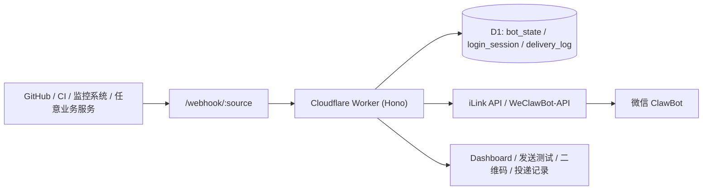
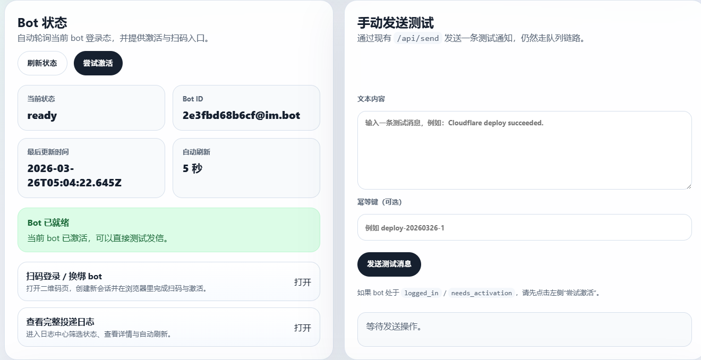
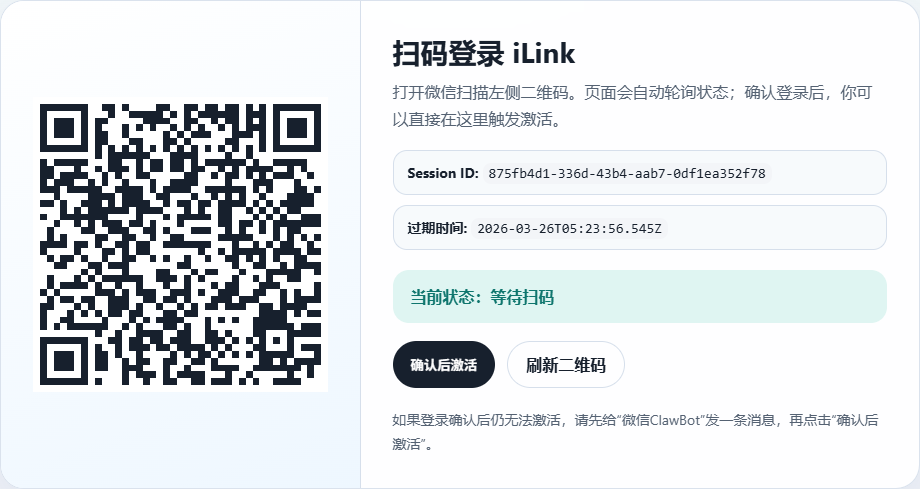

# ClawNotifier

基于 `Cloudflare Workers + Hono + D1` 的 iLink / WeClawBot Webhook 服务。

它把外部系统的文本通知桥接到微信 `ClawBot`，并补齐了 iLink 协议在云端部署时常见的几个缺口：扫码登录、`context_token` 激活、投递记录、失败重试，以及一个可直接在浏览器里操作的轻量管理页面。

[](https://deploy.workers.cloudflare.com/?url=https://github.com/feiling123/ClawNotifier)



---

## 目录

- [功能特性](#功能特性)
- [技术栈](#技术栈)
- [适用场景](#适用场景)
- [快速开始](#快速开始)
- [配置项说明](#配置项说明)
- [使用流程](#使用流程)
- [管理页面](#管理页面)
- [截图](#截图)
- [API 快览](#api-快览)
- [请求示例](#请求示例)
- [项目结构](#项目结构)
- [开发命令](#开发命令)
- [当前限制](#当前限制)
- [许可证](#许可证)

---

## 功能特性

| 能力 | 说明 |
|---|---|
| Webhook 入站 | 通过 `POST /webhook/:source` 接收业务系统通知，校验后同步发送并立即返回结果 |
| iLink 协议封装 | 内置 `get_bot_qrcode`、`get_qrcode_status`、`getupdates`、`sendmessage`、`sendtyping` |
| Bot 扫码登录 | 提供二维码会话创建、扫码状态轮询、登录结果持久化 |
| Bot 激活 | 首次登录后可主动执行激活，拿到 `context_token` 与 `get_updates_buf` |
| 实时投递 | 入站即同步发送到微信，失败自动带退避重试 |
| 敏感信息加密 | `bot_token`、`ilink_user_id`、`context_token` 等敏感字段入库前使用 AES-GCM 加密 |
| 投递记录 | 记录 `trace_id`、`dedupe_key`、状态、响应码、错误信息和尝试次数 |
| 幂等支持 | 传入 `dedupeKey` 时，按 `source + dedupeKey` 防止重复投递 |
| 自动保活提醒 | 通过 Worker 定时任务每 24 小时自动发送一条交互保活提醒 |
| 管理页面 | 提供总览、发送测试、扫码登录、投递记录，适合部署后直接使用 |

---

## 技术栈

| 模块 | 选型 | 说明 |
|---|---|---|
| 运行时 | Cloudflare Workers | 承载 HTTP 服务与定时任务 |
| 路由层 | Hono | 适合 Worker 的轻量路由与中间件 |
| 数据库 | Cloudflare D1 | 保存 bot 状态、登录会话、投递日志 |
| 语言 | TypeScript | 统一接口契约和类型约束 |
| 测试 | Vitest | 覆盖路由、加密逻辑、投递重试和协议适配 |
| 二维码 | `qrcode` | 服务端渲染 SVG 登录二维码 |

---

## 适用场景

| 场景 | 是否适合 |
|---|---|
| GitHub Actions / CI 完成后推送微信通知 | 适合 |
| 监控告警、值班消息、部署回调推送到微信 | 适合 |
| 只想要一个单 bot、单租户的轻量通知桥接 | 适合 |
| 多 bot、多租户、复杂权限系统 | 暂不适合 |
| 图片、文件、富媒体消息转发 | 暂不支持 |

---

## 快速开始

### 1. 克隆并安装依赖

```bash
git clone <your-repo-url>
cd claw-notifier
npm install
```

### 2. 一键部署

```bash
npm run deploy
```

`scripts/deploy.mjs` 会自动完成以下步骤：

1. 若 `wrangler.toml` 不存在，则从 `wrangler.toml.example` 生成；
2. 随机生成 `ADMIN_PATH`、`ADMIN_TOKEN`、`WEBHOOK_SHARED_TOKEN`、`BOT_STATE_ENC_KEY`（明文写入 `wrangler.toml` 的 `[vars]`，便于后续查找与调用）；
3. 若 D1 数据库不存在，则自动创建并写回 `database_id`；
4. 自动执行 D1 迁移（无需再手动导入数据库结构）；
5. 执行 `wrangler deploy`，并在结束后打印后台登录地址与全部凭证。

### 3. 本地调试

```bash
npm run dev
```

本地调试需先在 `wrangler.toml`（或 `.dev.vars`）中配置好 `ADMIN_PATH`、`ADMIN_TOKEN`、`WEBHOOK_SHARED_TOKEN`、`BOT_STATE_ENC_KEY`，并先执行本地迁移：

```bash
npm run cf:migrate:local
```

部署成功后，你会得到一个 `https://<your-worker>.workers.dev` 地址，后台入口为：

```text
https://<your-worker>.workers.dev/<ADMIN_PATH>/login
```

---

## 配置项说明

| 配置项 | 类型 | 必填 | 用途 |
|---|---|---|---|
| `ADMIN_PATH` | Variable | 是 | 后台入口路径前缀（随机生成），例如 `/a1b2c3d4e5f6a7b8` |
| `ADMIN_USERNAME` | Variable | 否 | 后台登录用户名，默认 `whoami` |
| `ADMIN_TOKEN` | Variable | 是 | 后台登录密码，同时保护 `/api/*` 接口 |
| `WEBHOOK_SHARED_TOKEN` | Variable | 是 | 校验 `/webhook/:source` 请求头中的 `X-Webhook-Token` |
| `BOT_STATE_ENC_KEY` | Variable | 是 | 加密 D1 中保存的敏感 bot 信息 |
| `ILINK_BASE_URL` | Variable | 否 | iLink API 地址，默认 `https://ilinkai.weixin.qq.com` |
| `KEEPALIVE_ENABLED` | Variable | 否 | 是否启用自动保活提醒，默认 `true` |
| `KEEPALIVE_INTERVAL_HOURS` | Variable | 否 | 自动保活提醒间隔小时数，默认 `24` |
| `KEEPALIVE_TEXT` | Variable | 否 | 自动保活提醒文本 |
| `DB` | D1 Binding | 是 | D1 数据库绑定 |

---

## 使用流程

| 步骤 | 操作 |
|---|---|
| 1 | 打开 `/{ADMIN_PATH}/login`，用户名 `whoami`、密码 `ADMIN_TOKEN` 登录 |
| 2 | 在左侧菜单点击“扫码登录”，或直接访问 `/{ADMIN_PATH}/bot/login/qrcode/page` |
| 3 | 使用微信扫码，轮询到 `confirmed` 为止 |
| 4 | 给“微信ClawBot”发一条消息，生成可用上下文 |
| 5 | 回到总览页点击“尝试激活”，拿到 `context_token` |
| 6 | 在左侧菜单“发送测试”发送测试消息，或让外部系统调用 `/webhook/:source` |
| 7 | 在左侧菜单“投递记录”查看投递结果和失败原因 |

---

## 管理页面

| 页面 | 地址 | 说明 |
|---|---|---|
| 登录页 | `/{ADMIN_PATH}/login` | 用户名 `whoami`、密码 `ADMIN_TOKEN` |
| 总览页 | `/{ADMIN_PATH}/dashboard` | 查看 bot 状态、激活、最近投递 |
| 发送测试 | `/{ADMIN_PATH}/send` | 发送测试消息并展示结果 |
| 二维码页 | `/{ADMIN_PATH}/bot/login/qrcode/page` | 浏览器直接展示登录二维码并自动轮询扫码状态 |
| 投递记录 | `/{ADMIN_PATH}/deliveries/page` | 筛选、翻页、查看详情、自动刷新 |

后台采用左侧菜单 + 右侧功能的布局，支持深色 / 浅色主题，可手动切换或自动跟随系统。

示例（将 `<ADMIN_PATH>` 替换为实际值）：

```text
http://127.0.0.1:8787/<ADMIN_PATH>/login
http://127.0.0.1:8787/<ADMIN_PATH>/dashboard?refresh=10&logsLimit=12
http://127.0.0.1:8787/<ADMIN_PATH>/deliveries/page?status=failed&limit=50&page=2&refresh=10
```

---

## 截图





---

## API 快览

| 方法 | 路径 | 鉴权方式 | 说明 |
|---|---|---|---|
| `GET` | `/healthz` | 无 | 健康检查，返回数据库和 bot 状态 |
| `GET` | `/{ADMIN_PATH}/login` | 无 | 后台登录页 |
| `POST` | `/{ADMIN_PATH}/login` | 无 | 登录，成功后写入会话 Cookie |
| `GET` | `/{ADMIN_PATH}/logout` | Cookie | 退出登录 |
| `POST` | `/{ADMIN_PATH}/bot/login/qrcode` | `Authorization: Bearer ADMIN_TOKEN` 或 Cookie | 创建登录二维码会话 |
| `GET` | `/{ADMIN_PATH}/bot/login/status/:sessionId` | `Authorization: Bearer ADMIN_TOKEN`、Cookie 或 `?token=` | 查询扫码状态 |
| `POST` | `/{ADMIN_PATH}/bot/activate` | `Authorization: Bearer ADMIN_TOKEN`、Cookie 或 `?token=` | 激活 bot，尝试获取 `context_token` |
| `GET` | `/{ADMIN_PATH}/bot/status` | `Authorization: Bearer ADMIN_TOKEN`、Cookie 或 `?token=` | 查询当前 bot 状态 |
| `GET` | `/{ADMIN_PATH}/deliveries` | `Authorization: Bearer ADMIN_TOKEN`、Cookie 或 `?token=` | 查询投递日志列表；支持 `page`（默认 `1`）和 `limit` |
| `GET` | `/{ADMIN_PATH}/deliveries/:deliveryId` | `Authorization: Bearer ADMIN_TOKEN`、Cookie 或 `?token=` | 查询单条投递详情 |
| `POST` | `/{ADMIN_PATH}/deliveries/batch/replay` | `Authorization: Bearer ADMIN_TOKEN`、Cookie 或 `?token=` | 批量重发指定的失败投递，JSON 传入 `deliveryIds`（最多 100 条） |
| `POST` | `/{ADMIN_PATH}/deliveries/batch/delete` | `Authorization: Bearer ADMIN_TOKEN`、Cookie 或 `?token=` | 批量删除已结束的投递日志并移除对应幂等记录，JSON 传入 `deliveryIds`（最多 100 条） |
| `POST` | `/api/send` | `Authorization: Bearer ADMIN_TOKEN` 或 Cookie | 管理员手动发送测试消息 |
| `POST` | `/webhook/:source` | `X-Webhook-Token` | 外部系统推送通知入口 |

---

## 请求示例

### 1. 发送测试消息

```bash
curl -X POST "http://127.0.0.1:8787/api/send" -H "Content-Type: application/json" -H "Authorization: Bearer ADMIN_TOKEN" -d "{\"text\":\"Cloudflare deploy succeeded\",\"dedupeKey\":\"deploy-20260326-1\"}"
```

### 2. 调用业务 Webhook

```bash
curl -X POST "http://127.0.0.1:8787/webhook/github" -H "Content-Type: application/json" -H "X-Webhook-Token: WEBHOOK_SHARED_TOKEN" -d "{\"text\":\"Release v1.0.0 published\",\"traceId\":\"github-release-001\",\"meta\":{\"repo\":\"demo/app\"}}"
```

### 3. 查询最近日志

```bash
curl "http://127.0.0.1:8787/<ADMIN_PATH>/deliveries?limit=20&status=delivered" -H "Authorization: Bearer ADMIN_TOKEN"
```

### 4. 标准消息体

```json
{
  "text": "build completed",
  "traceId": "optional-trace-id",
  "dedupeKey": "optional-dedupe-key",
  "meta": {
    "env": "prod"
  }
}
```

---

## 项目结构

| 路径 | 说明 |
|---|---|
| `src/index.ts` | Worker 入口，处理 HTTP 请求与定时任务 |
| `src/app.ts` | Hono 路由定义和鉴权 |
| `src/ilink/client.ts` | iLink 协议客户端 |
| `src/services/` | 管理、投递、健康检查等业务服务 |
| `src/storage/` | D1 仓储层 |
| `src/lib/` | 加密、校验、页面模板、错误处理等基础能力 |
| `migrations/0001_init.sql` | D1 初始化表结构 |
| `test/` | Vitest 测试用例 |

---

## 开发命令

| 命令 | 说明 |
|---|---|
| `npm run dev` | 本地启动 Worker |
| `npm run deploy` | 部署到 Cloudflare Workers |
| `npm run typecheck` | 执行 TypeScript 类型检查 |
| `npm test` | 执行测试 |
| `npm run test:watch` | 监听模式运行测试 |
| `npm run cf:migrate:local` | 对本地 D1 应用迁移 |
| `npm run cf:migrate:remote` | 对远程 D1 应用迁移 |
| `npm run cf:types` | 生成 Cloudflare 绑定类型 |

---

## 当前限制

| 项目 | 说明 |
|---|---|
| 单 bot | 当前只维护一个活跃 bot 状态 |
| 单租户 | 没有多用户和权限体系 |
| 仅文本消息 | 暂不支持图片、文件、卡片等复杂消息类型 |
| 无 iLink 入站转发 | 当前只处理“外部系统 -> 微信”这条链路 |
| 管理端较轻量 | 目前是 HTML 管理页，不是完整 SPA 控制台 |

---

## 协议参考

- iLink / WeClawBot-API: [https://github.com/Cp0204/WeClawBot-API](https://github.com/Cp0204/WeClawBot-API)

---

## 许可证

[MIT](LICENSE)
